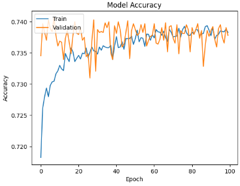
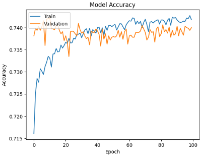

# Deep Learning Charitable Ventures Report

## Overview of the Analysis

 The analysis aims to develop a predictive neural network to determine the success of a charitable venture.

### Application Information and Prediction Target

The dataset 'charity_data' contains the application pool and holds the columns 'APPLICATION_TYPE', 'AFFILIATION', 'CLASSIFICATION', 'USE_CASE', 'ORGANIZATION', 'STATUS', 'INCOME_AMT', 'SPECIAL_CONSIDERATIONS','ASK_AMT', and 'IS_SUCCESSFUL'. The prediction target is 'IS_SUCCESSFUL' column, delineated as a binary output. With (1) indicating a success and (0) indicating a failure.

### Stage Information
1. Data Preprocessing: Included handling missing values, scaling, and encoding categorical variables if present.
2. Feature Selection: Identifying key features contributing to application success.
3. Model Development: Utilized binning for categorical variables, model layers are attributed sequentially.
4. Evaluation Metrics: Focused on model loss and accuracy based metrics.

## Results

* Model 1:
  * Binning for 'APPLICATION_TYPE' and 'CLASSIFICATION', threshold values are 700 and 100, respectively. Three layers, with neuron counts in this order: 80, 30, and 1. Activations are relu and sigmoid. Experimented with selu, hard_sigmoid, and tanh, but running relu repeatedly seemed like the go to before tripping the model into binary with the sigmoid activation.
    * Validation Results:

    
    
    * Loss: 55.8%
    * Accuracy: 72.7%

* Model 2:
  * Binning for 'APPLICATION_TYPE' and 'ASK_AMT', threshold values are 157 and 3, respectively. Four layers and a deactivation cycle. Neuron counts in this order: 128, 64, 32, and 1.  Activations are relu and sigmoid. Dropout cycle occurs right after the first layer, a random 40% of the units deactivate per epoch. Dropout was added to avoid overfitting the model to the training data. Experimented with selu and tanh, but running relu repeatedly created the best scenario given how ridiculous the categorical setup is.
    * Validation Results:

    
    
    * Loss: 55.6%
    * Accuracy: 72.9%

## Summary

Model 2 is barely *barely* better than model 1 and I think the reasoning for that is that the dropout addition created some regularization. I think a better approach regularization would be to reduce columns such that a classification randomizer have a more profound effect on the model accuracy.
